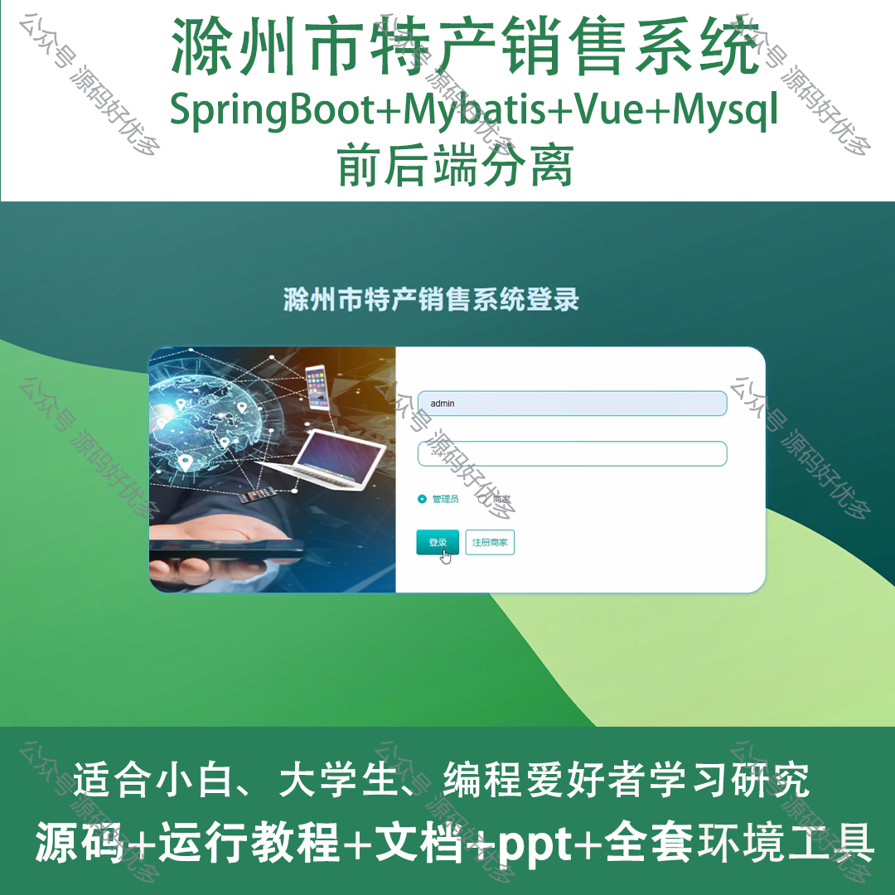
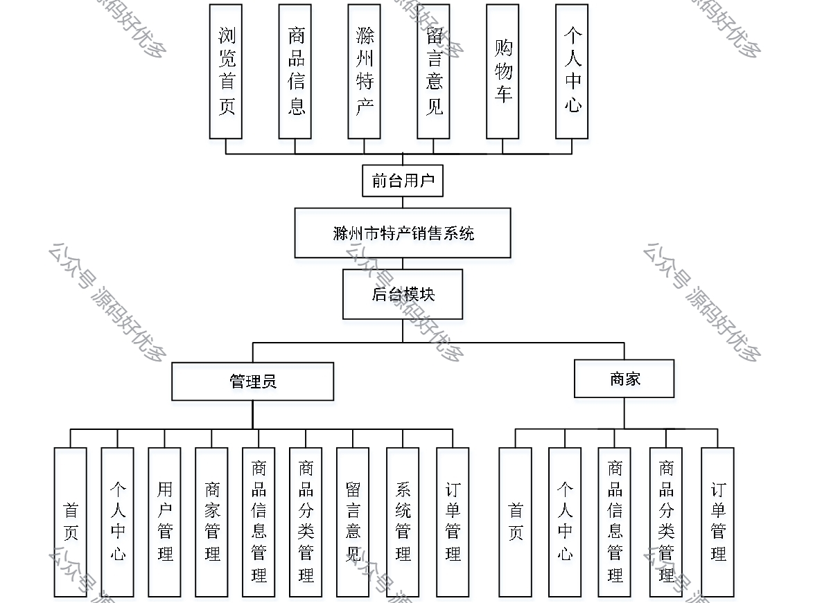
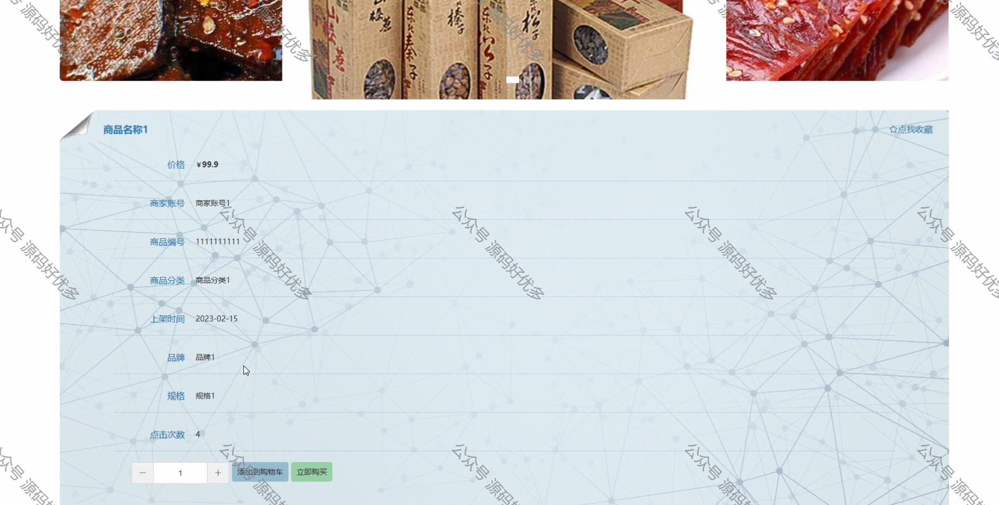
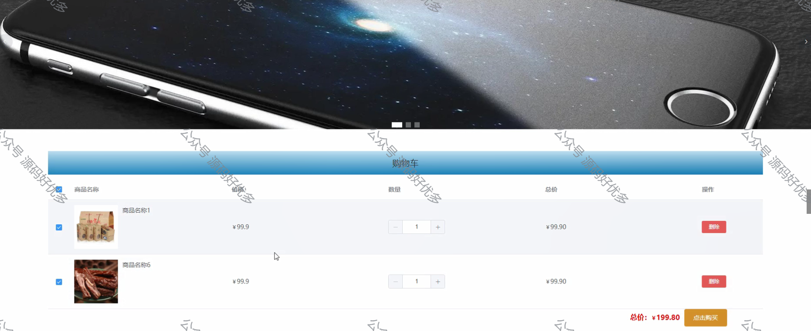
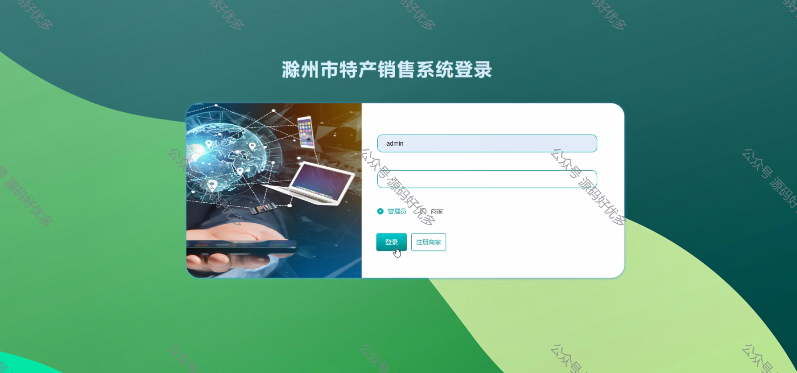
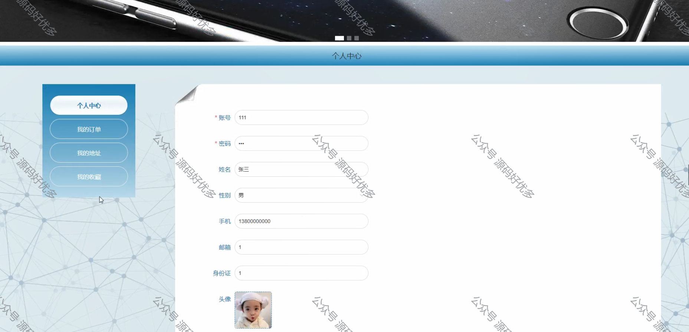
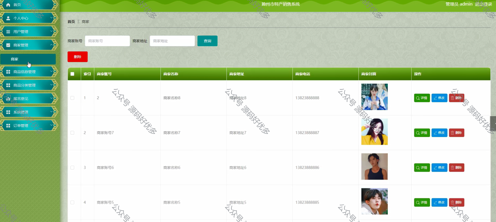
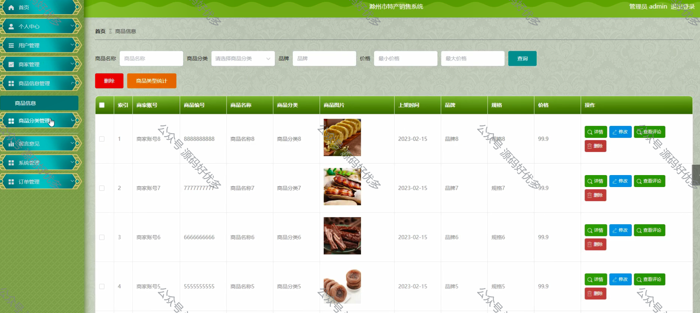
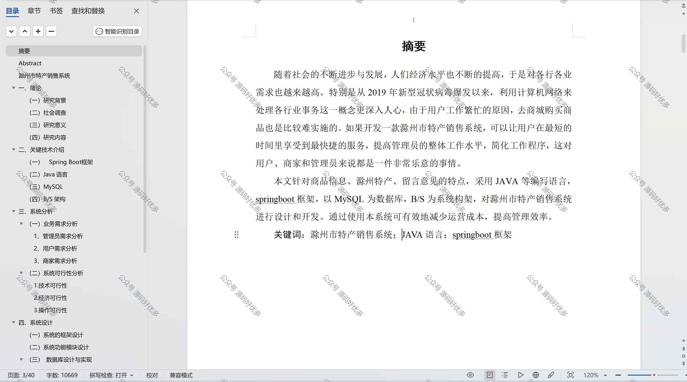

 
## 查看主页获取源码

> **作者介绍**： **✌**全网粉丝10W+本平台特邀作者、博客专家、CSDN新星计划导师、java领域优质创作者,博客之星、掘金/华为云/阿里云/InfoQ等平台优质作者、专注于项目实战 **✌**

  

### 一、作品包含

源码+数据库+设计文档万字+PPT+全套环境和工具资源+部署教程

### 二、项目技术

前端技术：Html、Css、Js、Vue、Element-ui

数据库：MySQL

后端技术：Java、Spring Boot、MyBatis

  

### 三、运行环境

开发工具：IDEA/eclipse

数据库：MySQL5.7

数据库管理工具：Navicat10以上版本

环境配置软件： JDK1.8+Maven3.6.3

前端Nodejs：14

### 四、项目介绍
项目编号：springbootA093

滁州市特产销售系统是一个旨在推广和销售滁州市特色产品的在线平台，它结合了地方文化特色与现代电子商务技术，为消费者提供了便捷的购物渠道，同时助力当地商家拓展市场，促进地区经济发展。

滁州市特产销售系统包括前台用户、后台模块、管理员和商家四个部分。

前台用户包括浏览首页、商品信息、滁州特产、留言意见、购物车和个人中心。
后台模块包括管理员和商家两个部分。
管理员包括首页、个人中心、用户管理、商家管理、商品信息管理、商品分类管理、留言意见、系统管理和订单管理。
商家包括首页、个人中心、商品信息管理、商品分类管理和订单管理。

### 五、运行截图

  
